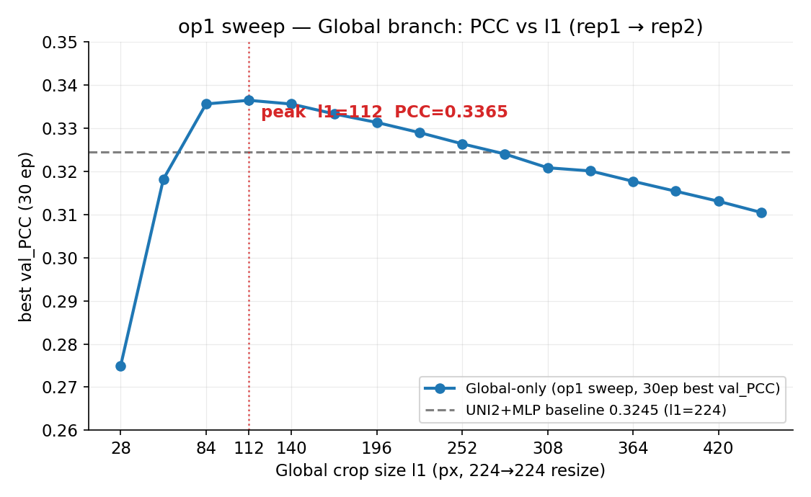
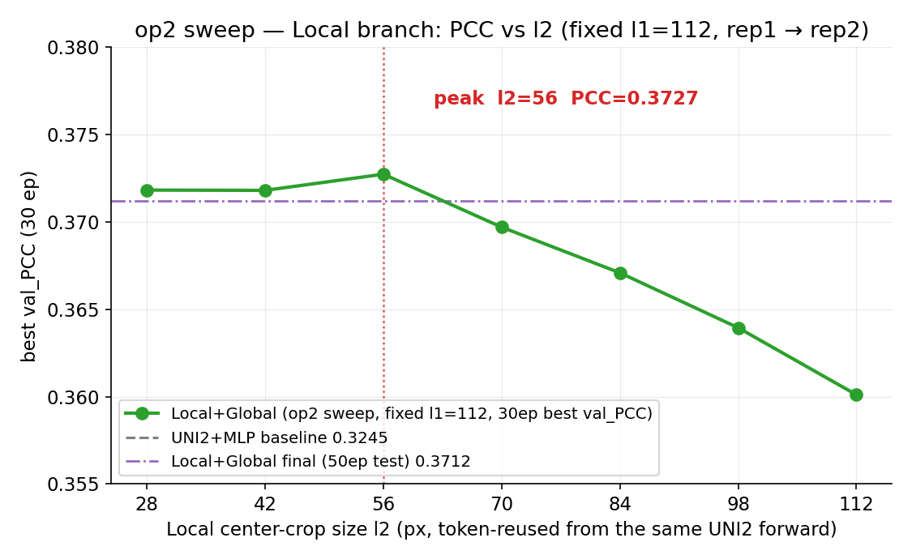

# HE2ST-pj

**HE→ST 任务**：从 H&E 组织学图像预测空间转录组（ST）基因表达。课题总体要求见本地文档 `D:\Desktop\其他学习资料\大二下\复芏\HE2ST-pj\课题总体情况及实现要求.txt`。

核心研究问题：
1. 简单有效的模型能否在 HE→ST 任务中达到甚至超过复杂空间模型？
2. Local（局部组织形态）与 Global（组织上下文）信息是否互补？如何简单利用两者？
3. 如何建立覆盖不同泛化场景的标准 Benchmark，公平比较现有方法？

## 目录结构

```
HE2ST-pj/
├── common/        # 所有方法共用模块（数据预处理、特征、模型、评估、工具）
├── methods/       # 每个方法一个独立文件夹（12 种方法）
│   └── uni2_mlp/  #   UNI2+MLP 基线 + Local-Global 双尺度改进
├── scripts/       # 统一入口：train / test / 特征提取（extract_*） / sweep
└── tests/         # 单元测试
```

## 开发约定

- **公平比较**：所有方法共用 `common/` 下的数据预处理与评估模块，保证预处理和评估方式一致。
- **核心原则（编码器冻结、MLP 训练）**：特征提取用到的编码器（UNI2 / CTransPath / HIPT / resnet50 / DenseNet 等）一律**冻结**（通常以预提取特征形式参与），接的 MLP / 预测头**训练**。该设置保证公平对比，并排除"编码器微调"带来的不公平优势（详见"关键结论信号"）。
- **官方实现**：每个方法严格按原论文架构和官方代码实现，禁止自行改架构；官方源码/权重参考 `D:\hest_data\codes`。UNI+MLP 使用 UNI2 权重。
- **统一 MLP 头**：纯 embedding 需外接头的方法使用 `common/models/mlp_head.py` 的统一架构；自带官方预测头的方法沿用官方头（如 DeepPT MLP_regression、Pixel2Gene ForwardSum、Path2Space MLP_regression_relu_two）。
- **MPP 对齐**：多切片情形必须统一 MPP（`common/data/alignment.py` 含坐标对齐与 MPP 统一对齐两个版本）。
- **评估指标**：回归（PCC、SPCC）、排序（Top-k 准确率）、分类（AUROC），见 `common/eval/metrics.py`。

## 环境

- 本地调试：conda 环境 `myenv`
- 远程服务器 `gpu-server`：conda 环境 `myenv1`，代码本地编写后上传运行

## 测试

```bash
conda activate myenv
python -m pytest tests/ -v
```

---

## Local-Global 双尺度实验（核心创新，✅ 完成）

**目标**：回答研究问题 2——Local 与 Global 信息是否互补，以及如何以简单方式同时利用两者。

### 方法设计

架构：`concat[UNI2(op1 放缩中心) CLS, UNI2 中心 patch token 复用(op2)] → MLP`

- **op1（Global branch）**：以目标细胞为中心取 l1×l1 图像块，resize 到标准 224×224，用 UNI2 提 [CLS] 特征——负责 tissue architecture、microenvironment。
- **op2（Local branch）**：**复用 op1 同一次 forward 的 patch token 网格**——UNI2 patch14 无重叠，224×224 一次 forward 出 16×16=256 个 patch token；中心裁剪 l2=14k 正对应该网格中心 k×k 子块，取子块 token 的 mean-pool 作为 Local 特征——负责 morphology、nucleus、cell neighborhood。

**关键约束：只做一次 forward**。Local 分支不做"裁剪→resize→再提"的二次 forward，而是从 Global 的 token 序列直接切出中心子块——op2 sweep 的全部 l2 值（28..112）免费复用同一份 token，**提取成本为零**。实现：`extract_tokens()` 返回 (B, 265, 1536) 全序列（1 CLS + 8 reg + 256 patch，timm `_pos_embed` 顺序已核实），`center_patch_tokens(k)` 切中心 k×k；`--stage local` 单次提取产出全部 l2 文件。

预测头为统一 MLPHead（3072→512→256→313，`local_global` 变体）。编码器 UNI2 冻结，仅 MLP 训练。

### 实验设置

- **数据**：相邻切片泛化情形 rep1（训练，164k cell）→ rep2（测试，111k cell），MPP 统一。
- **归一化**：`log1p_zscore`（统计量只在训练集拟合，测试集复用防泄漏）。
- **调参**：每配置 30 epoch + val_PCC patience=10 早停，取 best val_PCC 绘曲线；最终 50 epoch + 早停报告全量指标。
- **流程**：op1 sweep（只测 Global）→ op2 sweep（固定 best l1，Global+Local）→ 最终训练 → 消融。

### op1 sweep：Global 视野调参（PCC vs l1）

l1 从 **448 缩到 28、步长 28**（共 16 档），只测 Global（`--variant global_only`），每 l1 提取 Global 特征 + 30ep 训练取 best val_PCC。



| l1 | 448 | 420 | 392 | 364 | 336 | 308 | 280 | 252 | 224 | 196 | 168 | 140 | **112** | 84 | 56 | 28 |
|---|---|---|---|---|---|---|---|---|---|---|---|---|---|---|---|
| val_PCC | 0.3105 | 0.3131 | 0.3154 | 0.3177 | 0.3201 | 0.3208 | 0.3240 | 0.3264 | 0.3290 | 0.3313 | 0.3333 | 0.3356 | **0.3365** | 0.3356 | 0.3182 | 0.2750 |

**结论**：PCC–l1 曲线为**倒 U 型**，峰值 **l1=112（0.3365）**，比标准 224 基线（0.3245）高 **+0.012**；过大（>140）或过小（<84）均下降。Global 分支最优视野 ≈ **40.7 µm**（l1=112 × 2.7488 px/µm）。**best l1=112**。

### op2 sweep：Local 视野调参（PCC vs l2，固定 l1=112）

l2 = 28, 42, 56, 70, 84, 98, 112（= 中心 k×k token 子块，k=2..8，单次 forward token 复用）。`--variant local_global`，特征 = concat[X_uni2_g112, X_uni2_l{l2}]。



| l2 | 28 | 42 | **56** | 70 | 84 | 98 | 112 |
|---|---|---|---|---|---|---|---|
| val_PCC | 0.3718 | 0.3718 | **0.3727** | 0.3697 | 0.3671 | 0.3639 | 0.3601 |

**结论**：同样为**倒 U 型**，峰值 **l2=56（0.3727）**；扩展测试（28/42 两档）确认 56 是最佳——Local 视野过小（28/42，只含 ~1 个核）或过大（≥70）均下降。**best l2=56**（中心 4×4=16 个 patch token 的 mean-pool）。加入 Local 分支后 PCC 0.3365→0.3727，**+0.036**。

### 最终训练（best l1=112 + l2=56，50ep + 早停）

早停于 epoch 18（best val_PCC 0.3713）。rep1→rep2 全量测试指标：

| PCC | SPCC | Top-10 | Top-50 | Top-100 | AUROC |
|---|---|---|---|---|---|
| **0.3712** | 0.3071 | 0.5387 | 0.5882 | 0.6298 | 0.7592 |

vs UNI2+MLP 基线（0.3245）：**+0.047**。

### 消融实验（固定 best l1=112、l2=56）

| 配置 | 特征 | PCC | SPCC | Top-50 | AUROC |
|---|---|---|---|---|---|
| Global-only | 仅 l1=112 CLS | 0.3366 | 0.2908 | 0.5794 | 0.7437 |
| **Local+Global**（concat） | l1=112 + l2=56 | **0.3712** | 0.3071 | 0.5882 | 0.7592 |
| **Local-only** | 仅 l2=56 | **0.3732** | 0.3098 | 0.5901 | 0.7624 |

**消融结论**：**Local 分支主导**（Local-only 0.3732 ≈ Local+Global 0.3712，Global 的 CLS 几乎无增量）。原因：中心 token 经自注意力已携带全局上下文（单次 forward 设计固有属性），Local 特征实为"局部区域 + 全局上下文"，与 CLS 高度冗余。这也说明 **Local 信息的价值主要在于更精准的局部形态（morphology/nucleus），Global 视野带来的上下文在 CLS 与中心 token 中均已覆盖**。

### 补充变体

- **concat + LayerNorm**（`local_global_ln`，在 concat 输入上加 LayerNorm）：best val_PCC **0.3724** ≈ concat 版 0.3713，**无提升** → 按约定不再使用。

### 小结

Local+Global 双尺度在相邻切片基准上 **0.3245 → 0.3712（+0.047）**，全部来自**特征表示**（追加 Local 视野），模型仍是同一 MLP——再次印证项目主线 **"性能提升主要来源于更有效的信息表示，而非复杂的空间建模结构"**。调参数据见 `scripts/sweep.py`，曲线数据存于远程 `outputs/sweep_op1/op1_results.csv`、`outputs/sweep_op2*/op2_results.csv`。

---

## 状态（2026-08-20 更新）

- **12 种方法全部有最终合规结果** + **Local-Global 核心创新完成**（见上节）。
- **"编码器冻结、MLP 训练"原则已确立**（用户明确）：据此 ST-Net / BLEEP 的基准结果改用**冻结编码器版**（ST-Net 0.2386、BLEEP 0.2131），微调版仅作参考（见下）。
- **Path2Space 重训 ✅ 完成**：冻结 CTransPath（官方 ctranspath.pth）+ 训练官方 MLP 头。正式 rep1→rep2 **PCC 0.2780**。
- **SQUALL 官方解码器头 ✅ 完成**：冻结 token（196×1024）→ 训练 TransformerDecoder 头 = **0.3281**（vs 统一 MLP 0.2812）。
- **Pixel2Gene cell 官方 ForwardSum 头 ✅ 完成**：log1p 空间 **0.2913**（zscore 0.2699；统一 MLP 版 0.3085 作参考）。
- 相邻切片基准（rep1 训练 → rep2 测试）结果见下节；之后进行三层次泛化评测。

## 相邻切片基准结果（rep1 → rep2，2026-08-20 更新）

协议：50 epoch + val_PCC patience=10 早停（取 best 模型），lr=1e-3，AdamW，
`log1p_zscore` 归一化（统计量只在训练集拟合，测试集复用，防泄漏），统一评估（PCC/SPCC
归一化空间逐基因，Top-k/AUROC 逆变换回 raw counts 语义）。完整指标在各
`outputs/bench_*/test_results.json`。

### 合规结果（编码器冻结 + 头部训练，按 PCC 排序）

> 完整柱状图见 [`benchmark_pcc_bar.png`](benchmark_pcc_bar.png)（12 方法 PCC，基线标红）。

| 方法 | 编码器 | PCC | SPCC | Top-10 | Top-50 | Top-100 | AUROC | 备注 |
|---|---|---|---|---|---|---|---|---|
| **UNI2+MLP Local+Global**（改进） | UNI2 冻结 | **0.3712** | 0.3071 | 0.539 | 0.588 | 0.630 | 0.759 | l1=112+l2=56，核心创新（见上节） |
| **SQUALL**（官方解码器头） | 冻结 555M | 0.3281 | 0.2873 | 0.507 | 0.572 | 0.623 | 0.742 | token(196×1024)→训练 TransformerDecoder；头更强可利用 token 结构 |
| **UNI2+MLP**（基线） | UNI2 冻结 | 0.3245 | 0.2852 | 0.510 | 0.575 | 0.626 | 0.739 | 超 UNI1 基线 0.312 |
| **GHIST** | UNet 从头 | 0.3164 | 0.2952 | 0.500 | 0.525 | 0.516 | 0.700 | 官方 Framework（核 mask + 图），从零训练 |
| **SpatialEx** | UNI2 冻结 | 0.2964 | 0.2686 | 0.493 | 0.561 | 0.616 | 0.727 | 超官方 SpatialEx(UNI1) 0.256 |
| **Pixel2Gene**（cell 级） | HIPT 冻结 | 0.2913 | 0.2687 | 0.497 | 0.551 | 0.551 | 0.720 | 官方 ForwardSum 头 **log1p 空间**（zscore 0.2699）；统一 MLP 版 0.3085 作参考 |
| **SQUALL**（统一 MLP） | 冻结 555M | 0.2812 | 0.2581 | 0.481 | 0.560 | 0.622 | 0.715 | 0-1 输入修复后复核值 |
| **Path2Space**（重训训练头） | CTransPath 冻结 | 0.2780 | 0.2555 | 0.476 | 0.561 | 0.625 | 0.714 | 训练官方 MLP 头适配 per-cell（见下） |
| **DeepPT**（ResNet50 忠实版） | ResNet50-ImageNet | 0.2628 | 0.2478 | 0.470 | 0.556 | 0.624 | 0.707 | 官方特征 + 官方头（UNI2 特征版 0.3206 作参考，见 DeepPT 专节） |
| **ST-Net**（冻结 DenseNet） | DenseNet 冻结 | 0.2386 | 0.2318 | 0.457 | 0.545 | 0.620 | 0.694 | 微调版 0.3619 仅作参考 |
| **Hist2ST**（官方配置） | 从头 | 0.2139 | 0.2046 | 0.431 | 0.531 | 0.611 | 0.670 | 独立协议（见下），统一协议下不收敛 |
| **BLEEP**（冻结 resnet50） | resnet50 冻结 | 0.2131 | 0.2056 | 0.440 | 0.525 | 0.601 | 0.666 | 微调版 0.3235 仅作参考 |
| Pixel2Gene（spot 级） | HIPT 冻结 | 0.1687 | 0.1729 | 0.379 | 0.510 | 0.622 | 0.644 | spot 内异质性封顶 |
| Phoenix v2 | 流模型 | 0.1509 | 0.1304 | 0.409 | 0.474 | 0.539 | 0.592 | 官方 FlowTransformerModel |
| Phoenix v1 | 流模型 | 0.1001 | 0.0982 | 0.318 | 0.432 | 0.522 | 0.573 | 313 基因适配有限 |
| STFlow | 流模型 | 0.0933 | 0.1572 | 0.242 | 0.289 | 0.405 | 0.614 | log1p + zinb（官方默认）；gaussian 0.0847 作参考 |
| Path2Space（冻结集成） | CTransPath 冻结 | 0.0411 | 0.0354 | 0.148 | 0.323 | 0.432 | 0.526 | 冻结 154-MLP 集成不迁移（见下） |

> 统一协议：50ep + 早停 + log1p_zscore（统计量仅在训练集拟合）。Hist2ST 为**独立协议**
> （官方 100ep + lr1e-5 + ZINB + bake 自蒸馏），故单独一行不参与统一协议排序。Pixel2Gene
> cell 的 log1p 版（0.2913）为官方 ForwardSum 头在正数目标空间的结果；是否入主表待定
> （见"Pixel2Gene 呈现"）。全部原始数值见各 `outputs/bench_*/test_results.json`。

### Pixel2Gene cell：官方 ForwardSum 头 vs 统一 MLP 头（2026-08-20）

同特征（HIPT ViT-256 per-cell 384-d CLS）下，官方头与统一 MLP 头对比：

| 头 | 归一化空间 | PCC | 说明 |
|---|---|---|---|
| 统一 MLPHead | log1p_zscore | **0.3085** | 线性输出，无约束 |
| 官方 ForwardSum（ELU 输出） | log1p_zscore | 0.2699 | ELU(0.01,0.01) 输出≥0 与 zscore 负值目标冲突 |
| 官方 ForwardSum（ELU 输出） | **log1p** | 0.2913 | 正数目标下激活兼容，+0.021 |

**原因**：官方头 `net_out` 的 ELU(0.01,0.01) 输出层在 zscore 负值目标下被 0.01 地板截断
（同类机制：Path2Space `MLP_regression_relu_two` 的 ReLU 输出）。换 log1p 正数目标后
兼容性修复但仍低于 MLP（0.2913 vs 0.3085）：① log1p 目标极度零膨胀，ELU 无法输出精确 0
（负半轴梯度 0.01·exp(x) 消失）且带 +0.01 偏置，对零值系统性高估；② MLPHead 每层
BatchNorm+Dropout、首层加宽 512，官方头无归一化且立即瓶颈到 256；③ 官方头按 spot 级
576-d 特征调参。**结论：官方头忠实但不如统一 MLP，属"头适配任务分布"问题，非表示差距。**

### Path2Space 重训（✅ 完成，正式 rep1→rep2）

- **做法**：冻结 CTransPath（官方 ctranspath.pth）+ **训练**官方 MLP 头（`Path2SpaceMLP`，
  架构同官方 `MLP_regression_relu_two`，768→768→313）。特征走官方管线：**Macenko 染色
  归一化 + ctx512 大上下文**（`extract_ctranspath_context.py`，Macenko 与官方逐像素
  一致 corr≈0.9994）。
- **正式 rep1→rep2**（rep1 164k 训练 → rep2 111k 测试）：早停于 epoch 13（10ep 未提升），
  best val_PCC **0.2780**；全量指标 **PCC 0.2780 / SPCC 0.2555 / top10 0.476 /
  top50 0.561 / top100 0.625 / AUROC 0.713**。
- **对比**：冻结集成 ~0.02-0.04（无论 Macenko/上下文/平滑如何调都 ~0）→ 训练头
  **+0.24**。根因：冻结模型在 **spot 级目标**上训练，无法适配 **per-cell** 目标；
  训练头可适配。跨切片（rep1→rep2）下有效，说明是表示适配而非过拟合。
- **同切片验证**（rep2 分裂，80k/31k）：val_PCC **0.2725**，与跨切片 0.2780 一致。

### DeepPT ResNet50 忠实版（对比论文差异归因）

> **主表取值**：ResNet50 忠实版 **0.2628**（官方特征 + 官方头，编码器冻结）；UNI2 特征版
> 0.3206 仅作"表示"对比参考（不参与主表排序）。

官方 DeepPT（Hoang 2024, Nature Cancer）用 **ResNet50-ImageNet → AE(2048→512) → 官方 MLP_regression(512→512→G)** 预测整片 bulk 表达。为对照
SpatialEx 论文（其报告 DeepPT 在相同乳腺癌 Xenium 数据上 **~0.205**，低于 SpatialEx），
按官方流程实现忠实版（per-cell 适配）：官方 `ResNet50_IMAGENET1K_V2.pt` 提 2048-d 特征
→ AE 重构预训练 → 官方 MLP 头（`outputs/bench_deeppt_resnet50`）。

**结果对比**：

| 版本 | 特征 | PCC | 说明 |
|---|---|---|---|
| DeepPT（UNI2 特征版） | UNI2 冻结 | 0.3206 | 与 UNI2+MLP 基线 0.3245 接近 |
| **DeepPT（ResNet50 忠实版）** | ResNet50-ImageNet | **0.2628** | 官方特征 + 官方头（本 benchmark 统一协议） |
| SpatialEx 论文 DeepPT | ResNet50 | ~0.205 | 论文 280 基因面板等独立协议 |

**归因**：UNI2 → ResNet50 使 PCC **0.3206 → 0.2628（−0.06）**，特征提取器是主要因素；
剩余差距（0.2628 vs 0.205）来自协议差异（313 vs 280 基因、per-cell 粒度、归一化/训练设定）。
同时印证：**表示（Representation）强于架构**——相同官方头下，UNI2 特征（0.32）显著优于
ResNet50（0.26）。

### STFlow 低分归因（实现校验，2026-08-19）

STFlow（Huang et al. 2025）全基因 PCC 0.0847 偏低。按原论文协议做两层校验：

| 评估 | 全 313 基因 | Top50 HVG |
|---|---|---|
| zscore + gaussian | 0.0847 | 0.1846 |
| log1p + gaussian | 0.0758 | 0.2569 |
| **log1p + zinb（官方默认）** | 0.0933 | **0.3626** ✅ |
| 论文 | — | 0.3-0.4 |

**结论**：① 基因集是主因之一（Top50 HVG 显著高于全基因）；② **归一化空间（log1p）+ 先验
（zinb，官方默认）是关键**——官方配置下 **Top50 HVG = 0.3626，落在论文 0.3-0.4 区间**，
**实现正确性确认**。剩余小差距来自数据粒度（Xenium per-cell vs 论文 Visium spot）。
架构（SpatialTransformer + 流匹配）忠实官方，低分归因为评估协议而非实现。

### 参考结果（编码器微调 / 结构变体，非统一冻结协议，仅作参考）

| 方法 | PCC | SPCC | Top-50 | AUROC | 说明 |
|---|---|---|---|---|---|
| ST-Net（微调 DenseNet） | 0.3619 | 0.307 | 0.587 | 0.760 | 优势几乎全来自编码器微调（冻结后 0.2386） |
| BLEEP（微调 resnet50） | 0.3235 | 0.283 | 0.560 | 0.732 | 0.26 vs 0.32 之谜已解决：旧 0.2594 是 test.py 缺 `--img_size 224` 的 bug；`--img_size 224` 全量测试确认 **0.3235**（冻结后 0.2131） |
| UNI2+MLP improved（仅改 MLP） | 0.3248 | 0.284 | 0.576 | 0.736 | ≈ 基线 0.3245 → MLP 结构改进无收益，提升来自表示而非结构 |

## 细胞过滤后重跑（2026-08-22，进行中）

### 细胞过滤设置

对 rep1/rep2 做 QC 过滤，去除底部 ~13% 低表达/空白细胞（用户要求"去掉底部 10%"，
dry-run 看分布后取整）：

| 参数 | 值 | 依据 |
|---|---|---|
| `min_genes` | **40** | n_genes 的 p10 取整（rep1 p10=36、rep2 p10=37）；实测 40 去 ~13%，50 去 28% 过度 |
| `min_umis` | **100** | 已验证 min_umis∈[1,100] 结果完全相同（n_genes≥40 隐含 UMI≥100）；150 会额外去 5% |

**过滤效果**（dry-run 实测）：

| 切片 | 原始 | 过滤后 | 保留率 |
|---|---|---|---|
| rep1 | 164,000 | **141,804** | 86.5% |
| rep2 | 111,345 | **97,646** | 87.7% |

特征按保留行切片复用（`scripts/filter_cells.py`，mmap 分块直接写避开 cpfs 慢路径），
GHIST 数据按 cell_id 过滤。过滤后数据目录 `data/rep1_f`、`data/rep2_f`。

### 过滤后基准结果（rep1_f → rep2_f，统一协议，含新评估指标）

> 评估扩展：新增 **cell_PCC**（逐细胞跨基因，log1p 空间平均）与 **Top-k 全值（k=10..100）**。
> 原始列 = README 上一节的过滤前结果。**已完成 5 方法全部提升**（+0.010 ~ +0.017），
> 验证"过滤后指标整体提升"预期。

| 方法 | 原始 PCC | **过滤后 PCC** | Δ | cell_PCC | SPCC | Top-10 | Top-50 | Top-100 | AUROC |
|---|---|---|---|---|---|---|---|---|---|
| **SQUALL（解码器头）** | 0.3281 | **0.3495** | +0.021 | 0.697 | 0.301 | 0.536 | 0.591 | 0.647 | 0.732 |
| **UNI2+MLP** | 0.3245 | **0.3364** | +0.012 | 0.696 | 0.295 | 0.532 | 0.592 | 0.643 | 0.726 |
| **Pixel2Gene cell** | 0.2913 | **0.3074** | +0.016 | 0.681 | 0.280 | 0.516 | 0.577 | 0.571 | 0.725 |
| **SpatialEx** | 0.2964 | **0.3065** | +0.010 | 0.675 | 0.275 | 0.513 | 0.578 | 0.641 | 0.710 |
| **Path2Space** | 0.2780 | **0.2946** | +0.017 | 0.671 | 0.268 | 0.503 | 0.576 | 0.648 | 0.704 |
| **DeepPT (R50)** | 0.2628 | **0.2791** | +0.016 | 0.663 | 0.260 | 0.494 | 0.571 | 0.644 | 0.697 |
| **GHIST** | 0.3164 | 0.2926 | −0.024 | 0.631 | 0.276 | 0.483 | 0.543 | 0.645 | 0.673 |
| **ST-Net** | 0.2386 | **0.2520** | +0.013 | 0.648 | 0.242 | 0.476 | 0.561 | 0.649 | 0.682 |
| **BLEEP** | 0.2131 | **0.2322** | +0.019 | 0.616 | 0.220 | 0.450 | 0.534 | 0.613 | 0.657 |
| Hist2ST | 0.2139 | 0.2049 | −0.009 | 0.606 | 0.199 | 0.442 | 0.539 | 0.626 | 0.648 |
| STFlow | 0.0933 | **0.0997** | +0.006 | 0.331 | 0.160 | 0.265 | 0.305 | 0.411 | 0.611 |

**Top-k 曲线**：见 [`topk_accuracy_filtered.png`](topk_accuracy_filtered.png)（k=10..100，
11 方法，不同颜色）。完整逐 k 数值在各 `outputs/bench_*_f/eval_metrics.csv`。

**全部 11 方法完成**。**主要发现**：**9/11 提升**（SQUALL +0.021 最大），**2 个下降**：
Hist2ST（−0.009）与 GHIST（−0.024）——两者都是**从头训练**的图/patch 方法（无预训练
编码器），对细胞过滤敏感（图结构/核对齐受移除细胞影响）。AUROC 普遍微降是"过滤去除
easy negatives 使二分类判别变难"的统计效应（见上节讨论），不影响"过滤提升连续回归
性能"的总体结论。Local+Global 过滤后调参 + 消融进行中。

## 关键结论信号

1. **Local-Global 双尺度 0.3245 → 0.3712（+0.047），全部来自表示**：模型仍是同一 MLP，
   仅追加 Local 视野特征（token 复用，零额外 forward）；消融显示 **Local 分支主导**
   （Local-only 0.3732 ≈ Local+Global，Global 的 CLS 几乎无增量）→ **"表示 > 结构"最直接证据**。
2. **"编码器冻结、MLP 训练"下 UNI2+MLP（0.3245）领先复杂模型**：简单 Foundation 特征 +
   可训练头，超过冻结的领域模型（ST-Net 冻结 0.239、BLEEP 冻结 0.213、Path2Space 冻结 0.04）。
3. **编码器微调是 ST-Net / BLEEP 高分的唯一来源**：ST-Net 0.362→0.239（−0.12）、BLEEP
   0.3235→0.213。公平对比（编码器冻结）下简单方法领先 → 支持"性能来自表示而非微调"。
4. **Path2Space 冻结不迁移、训练头可迁移**：冻结集成无论 Macenko / 大上下文 / 空间平滑
   都 ~0.02；换成**训练**官方 MLP 头后同切片 **0.27+**。说明低分是"冻结模型无法适配
   per-cell 目标"，不是 CTransPath 特征差。
5. **UNI2+MLP improved（仅改 MLP）= 0.3248 ≈ 基线 0.3245**：MLP 结构改进无收益 →
   提升主要来自表示（Representation）而非模型结构。
6. **Pixel2Gene cell 级（0.29-0.31）显著高于 spot 级（0.169）**：per-cell 特征克服了 spot 内
   异质性封顶。
7. **官方预测头不一定优于统一 MLP**：Pixel2Gene ForwardSum（log1p 0.2913）、Path2Space
   ReLU 头（0.2780 重训后）都低于同特征下无约束线性输出的统一 MLP——官方头按原任务分布
   调参，换 per-cell 回归后头需重新匹配（再次支持"表示 > 架构"）。

## 方法实现清单与忠实度分析（2026-08-20 更新）

> 统一训练协议：50 epoch + val_PCC patience=10 早停（取 best），lr=1e-3，AdamW，
> `log1p_zscore` 归一化（统计量只在训练集拟合）。特例方法（Hist2ST/Phoenix/STFlow/
> Path2Space 冻结）走各自官方训练流程，见备注。
> **项目原则**：编码器冻结 + MLP 训练（ST-Net/BLEEP 用 `--no_finetune`）。

| 方法 | 架构 | 编码器 | 头部/模型 | 官方忠实度 | PCC | 指标评估 |
|---|---|---|---|---|---|---|
| **UNI2+MLP**（基线） | 特征回归 | UNI2 冻结（1536-d CLS） | 统一 MLPHead 1536→512→256→313 | 本仓库基线 | **0.3245** | 合理，作为对比基准 |
| **UNI2+MLP Local+Global**（改进） | 特征回归 | UNI2 冻结 | concat[Global CLS, Local 中心 token]→统一 MLPHead 3072→512→256→313 | 本仓库创新（token 复用单次 forward） | **0.3712** | 核心创新（见上节），+0.047 |
| **DeepPT** | 特征回归 | ResNet50-ImageNet | AE(2048→512)+官方 `MLP_regression`（Linear→Dropout→Linear） | ✅ 官方特征 + 官方头忠实版 | 0.2628 | 合理（官方忠实版；UNI2 特征版 0.3206 作参考，见专节） |
| **Pixel2Gene** | 特征回归 | HIPT 冻结 | 官方 `ForwardSumModel`（576→256×4 FFN+ELU 输出头） | ✅ 官方头；cell 级为方案 B | 0.2913 / 0.169 | cell 级合理（log1p 空间），spot 级受异质性封顶 |
| **SpatialEx** | 超图 GNN | UNI2 冻结 | MLP→HGNN→Linear，超图 kNN k=7 | ✅ 官方架构；cell-level MSE 为可选适配 | 0.2964 | 合理，超官方(UNI1)0.256 |
| **ST-Net** | CNN 回归 | DenseNet **冻结**（`--no_finetune`） | Linear 回归头 | ✅ 官方 DenseNet 架构；冻结为项目原则 | 0.2386 | 合理（冻结）；微调 0.3619 仅参考 |
| **BLEEP** | 对比学习 | resnet50 **冻结** | 对比投影头 | ✅ 官方架构；冻结为项目原则 | 0.2131 | 合理（冻结）；微调 0.3235 仅参考 |
| **SQUALL** | Transformer 多模态 | 冻结 555M 特征 | 官方 `SQUALLDecoderHead`（TransformerDecoder→313，训练） | ✅ 官方解码器头训练版 | 0.3281 | 解码器头可训练时最强（vs 统一 MLP 0.2812）；0-1 输入修复后 |
| **Phoenix** | 流匹配（生成） | 流模型 | 官方 `FlowTransformerModel` | ✅ v2 官方架构 | 0.1509 / 0.100 | 生成式采样不适配 per-cell 回归 |
| **STFlow** | 流匹配（生成） | UNI2 冻结 | `SpatialTransformer` 去噪器（ROI 级） | ✅ 官方架构纯 torch 移植 | 0.0933 | **log1p + zinb（官方默认）**（gaussian 0.0847 作参考）；Top50 HVG 官方配置 **0.3626**，论文 0.3-0.4 |
| **Path2Space** | MLP 集成 | CTransPath 冻结 | 官方 `MLP_regression_relu_two`（**训练**头） | ✅ 重训方案（冻结集成 ~0.04 不迁移） | **0.2780** | 重训头适配 per-cell，跨切片有效 |
| **GHIST** | UNet+图 | UNet 从头 | Framework 图模型 | ✅ 官方 Framework 移植 | **0.3164** | 数据管线 + tiling 完成；从零训练追平 UNI2 特征系 |
| **Hist2ST** | 图 Transformer | 从头 | Convmixer+Transformer+GNN | ✅ 官方架构 | null→**0.2139**（官方配置） | 协议是根因，官方配置有真实学习 |

### 忠实度与指标评估要点

1. **特征回归类方法（UNI2+MLP / DeepPT / Pixel2Gene / SpatialEx / SQUALL / Path2Space）**
   均以**冻结的 Foundation 特征**为输入、训练各自头部——结构最忠实、指标 0.21-0.33，反映"表示 + 简单头"的力量。
2. **编码器微调类（ST-Net / BLEEP）**：官方架构本身微调编码器；按项目"冻结原则"改用 `--no_finetune`
   （0.239 / 0.213）。微调版（0.362 / 0.324）作为"微调增益"的参考证据，不计入合规表。
3. **生成式方法（Phoenix / STFlow）**：忠实复现官方流匹配架构，但**生成式采样不适合 per-cell 回归**，
   指标 0.09-0.15 属方法性质使然（与基线同特征对比：UNI2+MLP 0.32 vs STFlow 0.09）。
4. **从头学习方法（Hist2ST / GHIST）**：无预训练特征，统一协议下难收敛（Hist2ST null），
   官方配置重训才有学习（**0.2139**）；GHIST 因核分割 + 整片 tiling 数据管线（官方 256×256
   patch + overlap 30）已跑通，从零训练追平 UNI2 特征系（**0.3164**）。
5. **Path2Space**：冻结 154-MLP 集成在 Xenium per-cell 上 ~0.02-0.04（spot 级训练目标不迁移）；
   **重训**官方 MLP 头（冻结 CTransPath）后正式 rep1→rep2 **0.2780**。
6. **SQUALL**：官方解码器推理（`forward_rgb_to_expr` → 15757 基因）在 per-cell 上 ~0.02
   （解码器输出近常量，不迁移）；冻结 555M 编码器特征 + **训练官方 TransformerDecoder 头** =
   **0.3281**（token 级信息被更强头利用）。早期特征提取误用 0-255 输入（官方教程为 0-1），
   已用 0-1 复核。

### 各方法实现总结（原始粒度 → cell-level 适配 → 实现方式）

> 核心问题：HE→ST 各方法原始面向的粒度不同（**slide/spot/cell**）。本 benchmark 统一在
> **per-cell**（Xenium）粒度评估。下表总结每种方法的原始粒度、到 cell-level 的适配方式，
> 以及实现方式（从头训练 / 冻结编码器 + 训练头 / 官方权重）。

| 方法 | 原始粒度 | cell-level 适配 | 实现方式 | 编码器来源 |
|---|---|---|---|---|
| **UNI2+MLP**（基线） | 基础模型（patch 级） | 每细胞 256×256 patch → UNI2 特征 | **冻结 UNI2** + 训练 MLP 头 | UNI2（ViT-L/14，HF） |
| **UNI2+MLP Local+Global** | 同上 | 同上 + 中心 token 局部特征 | 冻结 UNI2 + 训练 MLP（单次 forward） | UNI2 |
| **DeepPT** | **slide 级**（整片 bulk 表达） | 每细胞 patch → ResNet50 特征（per-cell） | 冻结 ResNet50(ImageNet) + AE 预训练 + 训练官方 MLP 头 | ResNet50-ImageNet |
| **Pixel2Gene** | **spot 级**（Visium） | 每细胞 patch → HIPT 层级特征 | 冻结 HIPT + **训练官方 ForwardSum 头** | HIPT-4K（DINO） |
| **SpatialEx** | **spot 级**（Visium 超图） | 每细胞为超图节点，kNN(k=7) 自环 | UNI2 冻结 + 训练超图卷积头（HGNN） | UNI2 |
| **ST-Net** | **spot 级**（Visium CNN+图） | 每细胞 patch → DenseNet121 | 冻结 DenseNet + 训练线性头（官方 bias 均值初始化） | DenseNet121-ImageNet |
| **BLEEP** | **spot 级**（Visium 对比） | 每细胞 patch → resnet50 | 冻结 resnet50 + 训练对比投影头 + 参考集检索 | resnet50-ImageNet |
| **SQUALL** | **spot 级**（224 patch 多模态） | 每细胞 patch = 独立 spot | 冻结 SQUALL 编码器 + 训练 MLP / TransformerDecoder 头 | SQUALL（555M 冻结） |
| **Phoenix** | **cell 级**（单细胞生成） | 本身 cell 级 | **官方预训练权重**：零样本（不迁移）或微调（flow 可训练，DINOv2 冻结） | DINOv2 ViT-Giant + flow |
| **STFlow** | **spot 级**（Visium 流匹配） | 每细胞为节点，ROI 批内流匹配 | UNI2 冻结 + 训练流匹配去噪器 | UNI2 |
| **Path2Space** | **spot 级**（Visium MLP 集成） | 每细胞 patch → CTransPath 特征 | 冻结 CTransPath + **重训官方 MLP 头**（冻结集成不迁移） | CTransPath（Swin） |
| **GHIST** | **cell 级**（核级分割+图） | 本身 cell 级 | **从头训练** UNet + Framework 图 | 无预训练 |
| **Hist2ST** | **spot 级**（Visium Transformer+GNN） | 每细胞为节点，ROI 内图 | **从头训练** | 无预训练 |

#### 详细说明

**1. UNI2+MLP（本仓库基线，patch 级 → cell）**
UNI2 是 patch 级病理基础模型（ViT-L/14）。把每个细胞的 256×256 patch 作为独立输入，
提取 UNI2 CLS（1536-d）+ 局部中心 token → 训练统一 MLP 头。**无官方预测头**，属"基础模型
特征 + 线性探针"式。Local+Global 改进在**单次 forward** 内同时取 CLS 与中心 token 网格。

**2. DeepPT（slide 级 → cell）**
官方 DeepPT 用 ResNet50-ImageNet 整片特征预测 **bulk 表达**（slide 级）。适配：每细胞
patch → ResNet50 2048-d 特征 → AE(2048→512) 重构预训练 → 训练官方 `MLP_regression`
头。**ResNet50 冻结**（ImageNet 预训练），仅 AE+头训练。

**3. Pixel2Gene（spot 级 → cell）**
官方在 **伪 Visium spot**（100µm 六角格）上用 HIPT-4K 提取 576-d 特征 + ForwardSum 头。
适配（方案 B）：每细胞 patch → HIPT level-1 ViT-256 CLS（384-d）→ **训练官方 ForwardSum
头**（n_inp 适配 384）。HIPT 冻结（DINO 预训练）。

**4. SpatialEx（spot 级 → cell）**
官方是 Visium spot 上的**超图卷积**。适配：每细胞为超图节点，用 kNN(k=7)+自环建超图
（复用 `common/data/slide_tiling.py`，与官方 `Build_hypergraph_spatial_and_HE` 语义一致），
ROI 内子图 hpnn 归一化。**UNI2 特征冻结**，训练 HGNN 超图卷积头。

**5. ST-Net（spot 级 → cell）**
官方 ST-Net 是 Visium spot 上的 CNN+GNN。适配：每细胞 patch → DenseNet121 → 线性输出
（bias 官方均值初始化）。**DenseNet 冻结**（ImageNet），仅线性头训练。

**6. BLEEP（spot 级 → cell）**
官方 BLEEP 是 Visium spot 双模态对比学习（图像↔表达嵌入对齐）。适配：每细胞 patch →
resnet50 → 对比投影头训练；推理时用**训练集参考集检索**（top-50 加权聚合参考 spot 表达）。
**resnet50 冻结**（ImageNet），对比投影头训练。

**7. SQUALL（spot 级 → cell）**
官方 SQUALL 输入 224×224 patch 输出 spot 级表达（15757 基因）。适配：**每细胞 patch =
独立 spot**（per-cell patch → forward_rgb → 196 token / mean-pool 特征）。冻结 555M 编码器
（官方预训练权重）+ 训练统一 MLP 或 **TransformerDecoder 头**。官方**冻结解码器**直接推理
≈0.02 不迁移；**训练头**有效（0.33-0.35）。基因经 `gene_token_homologs.csv` 映射。

**8. Phoenix（cell 级）**
官方 Phoenix 本身就是 **per-cell 生成模型**（flow matching，DINOv2 ViT-Giant 编码器 +
流 transformer，泛癌预训练权重）。适配：直接加载官方 `flow_model.pth`（含 DINOv2，224
分辨率）。**零样本**（Rep2 直接推理）不迁移（PCC≈0）；**微调**（Rep1，flow 可训练，
DINOv2 冻结）val_PCC≈0.22。图像按官方 tissue 归一化。

**9. STFlow（spot 级 → cell）**
官方 STFlow 是 Visium spot 流匹配。适配：每细胞为节点，ROI 批内 SpatialTransformer 训练
流匹配（log1p+zinb 官方默认先验），评估逐 ROI 采样对齐回 per-cell。**UNI2 特征冻结**
（替代官方 gigapath，同 1536-d 槽位），训练去噪器。

**10. Path2Space（spot 级 → cell）**
官方是 154-MLP 集成（22×7 交叉验证），spot 级目标训练。适配：每细胞 patch → CTransPath
（Macenko 染色归一化 + ctx512 大上下文）768-d → **重训官方 MLP 头**（768→768→313，训练）。
**CTransPath 冻结**（官方 ctranspath.pth）。冻结集成在 per-cell 上 ~0.04 不迁移；训练头
0.278-0.295。

**11. GHIST（cell 级）**
官方 GHIST 本身就是 **per-cell 图方法**（UNet 核分割 + 细胞型 + Framework 图预测核表达）。
**从头训练**（无预训练编码器），官方 9 损失（分割 CE + 细胞型 CE + 表达 MSE + 免疫/浸润
MSE + 组成 KLDiv）。需核分割 mask（Xenium 核多边形 → HE 像素 mask，2D 仿射对齐 <0.5px）。

**12. Hist2ST（spot 级 → cell）**
官方 Hist2ST 是 Visium spot 的 Transformer+GNN。适配：每细胞为节点，ROI（~512 细胞）内
建局部 kNN 邻接图，自注意力 + GNN。**从头训练**（官方配置：ZINB + bake 自蒸馏 + 100ep +
lr1e-5；统一协议下不收敛，官方配置才有学习）。

#### 关键观察

- **适配规律**：绝大多数方法是 **spot 级 → per-cell**，统一做法是"每细胞 patch = 一个
  spot/节点"，再套用原架构（图/超图/检索/流匹配）。SQUALL 是最直接的（patch 即 spot）；
  DeepPT 从 slide 级降粒度；Phoenix 与 GHIST 本身 cell 级。
- **实现方式分层**：① 冻结基础模型特征 + 训练头（UNI2/DeepPT/Pixel2Gene/SpatialEx/
  ST-Net/BLEEP/SQUALL/STFlow/Path2Space，0.21-0.37）；② 官方预训练权重零样本/微调
  （Phoenix）；③ 从头训练（GHIST/Hist2ST）。
- **"冻结编码器 + 训练头"是有效范式**：即便官方提供完整模型（SQUALL 解码器、Path2Space
  集成、BLEEP 检索），**冻结权重直接推理多不迁移**（~0.02-0.04），训练头后才有效
  （0.28-0.35）——这是项目核心结论"表示 > 架构"的又一佐证。

## 数据预处理与评估统一流程（公平性保障）

### 数据预处理（共用 `common/data/`，所有方法读同一数据目录格式）

1. **h5ad → 数据目录**（`preprocess.py`）：`extract_patches_from_h5ad` 从 h5ad 坐标
   （image_col/image_row）在整片 H&E 上裁 256×256 patch，导出 `patches/cell_{id}.png`、
   `gene_expression.npy`（**raw counts**，log1p 逆变换回整数）、`gene_names.txt`、
   `metadata.csv`（含 x_centroid/y_centroid 像素坐标）→ **所有方法输入一致**。
2. **特征提取**（per-method，编码器不同故分开，均冻结）：UNI2、CTransPath、HIPT、
   SQUALL、Local+Global → `data_dir/X_*.npy`；方法只读特征。
3. **归一化**（`expression.py`）：默认 `log1p_zscore`，统计量（mean/std）只在**训练集**
   拟合、测试集复用（`save_stats_json` 防泄漏）。
4. **MPP 对齐**（`alignment.py`）：`align_by_coords`（按坐标）与 `align_by_mpp`（统一 MPP）
   两版本（当前 rep1/rep2 同 MPP，天然一致）。
5. **数据集**（`dataset.py`）：`HESTDataset`（patch 输入）与 `FeatureDataset`（特征输入，
   支持多文件 concat，Local+Global 用）。

### 评估（共用 `common/benchmark/harness.py` + `common/eval/metrics.py`）

1. **统一指标**（`metrics.py`）：PCC/SPCC（归一化空间逐基因）、**cell_PCC（逐细胞跨基因，
   log1p 计数空间）**、Top-k（逐细胞 raw counts 语义，**默认 k=10,20,...,100 全值**）、
   AUROC（逐基因 raw counts>0）。全部经 `compute_metrics_vectorized`（`harness.py`），
   `details=True` 时额外返回逐基因 PCC/SPCC/AUROC 数组（CSV 导出）。
2. **统一协议**：50 epoch + val_PCC patience=10 早停 + lr=1e-3 + AdamW + log1p_zscore；
   `fit()` 统一训练，`evaluate()` 统一评估；结果存 `eval_metrics.csv`（摘要 + 逐基因）。
3. **各方法评估路径**（最终指标都走同一个 `compute_metrics_vectorized`）：
   - **标准 harness**（BLEEP/DeepPT/Phoenix/SQUALL/ST-Net/uni2_mlp/Pixel2Gene/Path2Space
     训练版）：`evaluate(model, loader, ...)`。
   - **整片图方法**（SpatialEx/Hist2ST/STFlow/GHIST）：`evaluate_slide` 整片建图/ROI 推理，
     指标用同一个 `compute_metrics_vectorized`（语义逐字节一致）。
   - **冻结推理**（Path2Space 冻结 / SQUALL 解码器）：各自 test 脚本，同样调用
     `compute_metrics_vectorized`。
4. **归一化语义**：PCC/SPCC 在归一化空间（统计量来自训练集）；Top-k/AUROC 经
   `_invert_normalization` 逆变换回 raw counts 语义。

### 检查结论

- **所有方法最终指标均来自 `compute_metrics_vectorized`**（或其调用者 evaluate/evaluate_slide），
  指标语义一致 → **公平比较成立**。
- 数据预处理共用同一数据目录格式、归一化与统计量防泄漏；特征提取因编码器不同而分开
  （各方法按其官方编码器提取，属合理差异），输入粒度和输出语义统一。

## 下一步实验计划

按优先级：

1. ~~Local+Global 双尺度正式实验~~ ✅ 完成：op1 sweep（best l1=112, 0.3365）→ op2 sweep
   （best l2=56, 0.3727）→ 最终 50ep **0.3712** → 消融（Local-only 0.3732 主导）→
   lg_ln 变体（无提升，弃用）。曲线见 `local_global_op1_sweep.png` / `local_global_op2_sweep.png`。
2. ~~GHIST 训练收尾~~ ✅ 完成：**PCC 0.3164**（已补基准表）。
3. ~~STFlow 实现校验~~ ✅ 完成：官方配置（log1p+zinb）Top50 HVG **0.3626**（见归因专节）。
4. ~~官方预测头补齐~~ ✅ 完成（用户原则：官方有头不换统一 MLP）：
   - ~~Pixel2Gene cell 级改用官方 ForwardSumModel~~ ✅（log1p 空间 0.2913）；
   - ~~SQUALL 官方 TransformerDecoder 头训练~~ ✅（0.3281）。
5. ~~Pixel2Gene cell 呈现决策~~ ✅ 已定：主表用官方 ForwardSum 头 **log1p 版 0.2913**，
   统一 MLP 版 0.3085 作参考。
6. **三层次泛化评测**：同切片左右半 → 相邻切片（MPP 统一）→ 同癌种多切片。
7. **多组学验证**：肾癌切片（基因+蛋白双组学）。
8. **跨癌种验证**：结直肠/肺癌/卵巢训练 → 乳腺癌测试。
9. 同步更新 README/CLAUDE.md 与 GitHub。

## Hist2ST 收敛失败说明

官方设计为 350 epoch + lr 1e-5(Adam) + ZINB + 自蒸馏（bake），从原始 patch 从头训练
组织特征。统一协议（50 epoch、MSE）下 6 epoch 后 val_PCC≈0、loss 卡在归一化表达方差
（模型退化为预测每基因均值）。超参探针（子采样 20k 细胞，扫 lr 3e-3/1e-2 × ZINB
0/0.25，各 5 epoch）显示：纯 MSE 全部 val_PCC≈0；加 ZINB 最高峰值仅 0.027 且随后
过拟合回落。结论：该架构在 50-epoch 统一协议下无法收敛到有意义结果，如实记为
null result（探针日志：`logs/hist2st_probe/`）。不收敛的根因是**不使用预训练特征**
（从原始 patch 从头学），与简单方法用 UNI2 预训练特征形成对比。

**官方配置重训结果（✅ 完成）**：`--epochs 100 --lr 1e-5 --zinb 0.25 --zinb_coef 0.25
--bake 5 --lamb 0.5`，early stop at **epoch 66**，全量 **PCC 0.2139 / SPCC 0.205 /
top100 0.611 / AUROC 0.670**。证明统一协议 null 的根因是**协议**（50ep + MSE 无预训练
特征下无法收敛），而非架构本身——但即便如此，从头学方法（0.21）仍远低于简单
Foundation 特征方法（UNI2+MLP 0.32），再次支持"表示 > 架构/训练技巧"。

## 同步状态（2026-08-22）

- **GitHub main**：全部方法代码 + Local+Global 框架 + 评估模块扩展（cell_PCC、Top-k 全 k、
  CSV 导出）+ 细胞过滤（`filter_cells.py`）+ 过滤后重跑编排（`run_bench_filtered.sh`、
  `run_lg_filtered.sh`）+ Phoenix 官方权重支持（零样本/微调）。最新提交 `1c039b0` 起。
- **远程代码 = 本地**（cpfs `.../HE2ST-pj`，`~/HE2ST-pj` 为符号链接）。
- **远程环境要点**：系统 python3.12 + torch2.5.1；pytorch.org/pypi 可达、github/HF 不可达；
  cpfs 小文件并行读会 D-state 卡死（patch/大特征文件需放 `/tmp` nvme）。
- 运行结果文件（`outputs/bench_*/`、`outputs/sweep_*/`）不入库（gitignore），保存在远程。
